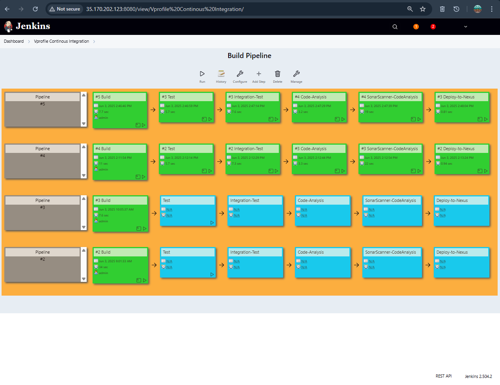
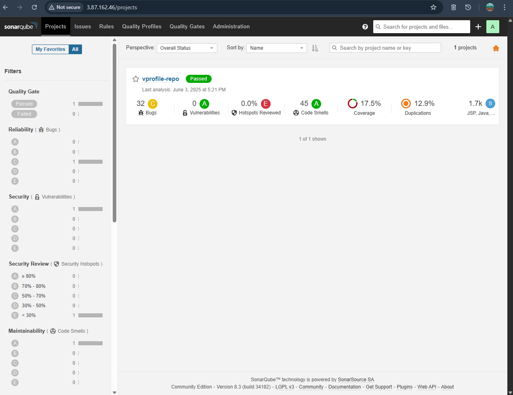
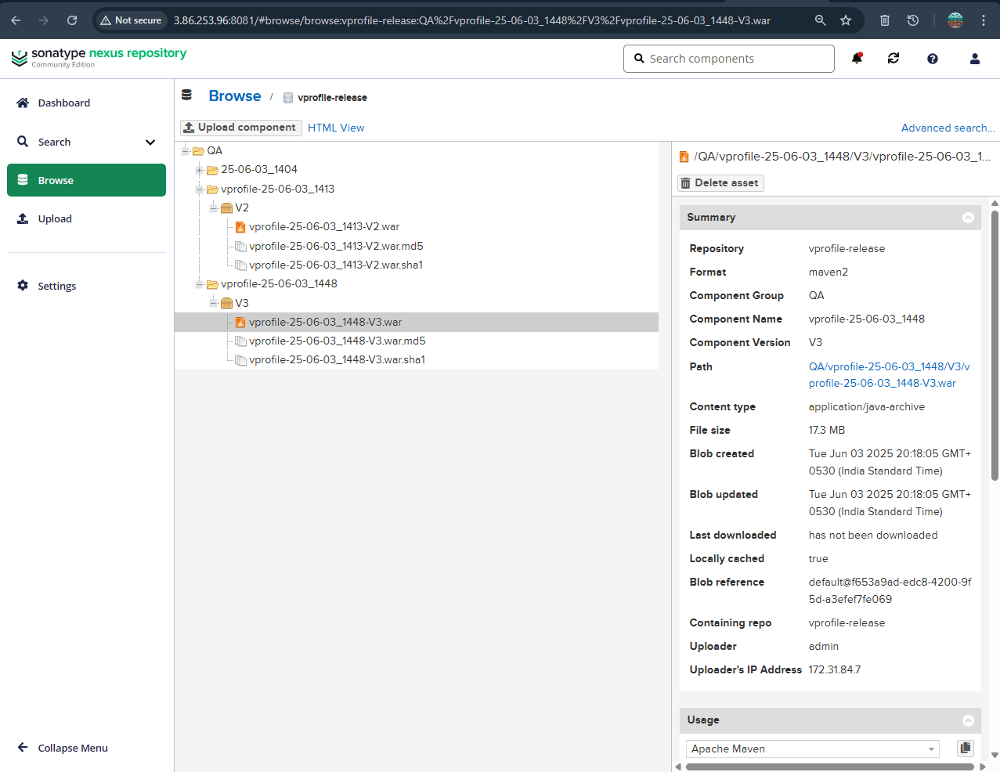

# Continuous Integration Pipeline using Jenkins, Maven, SonarQube & Nexus

This project demonstrates an automated **Continuous Integration (CI)** pipeline for a Java-based web application using **Jenkins**, with integrations to **Maven**, **SonarQube**, **Nexus**, and **Slack**.

---

# Tools Used

- Jenkins (CI server)
- Git (GitHub)
- Maven (build tool)
- SonarQube (code quality scanner)
- Nexus (artifact repository)
- Slack (notifications)
- AWS EC2 (Jenkins, Sonar, Nexus servers)

---

# CI Pipeline Workflow

1. Developer pushes code to GitHub  
2. Jenkins pulls the code using Git plugin  
3. Maven builds the `.war` file  
4. SonarQube scans code for quality issues  
5. Artifact is uploaded to Nexus repository  
6. Slack sends notification about build success/failure

## 📸 Screenshots

### ✅ Jenkins Job Config

### ✅ SonarQube Scan

### ✅ Nexus Upload

### ✅ Slack Notification

